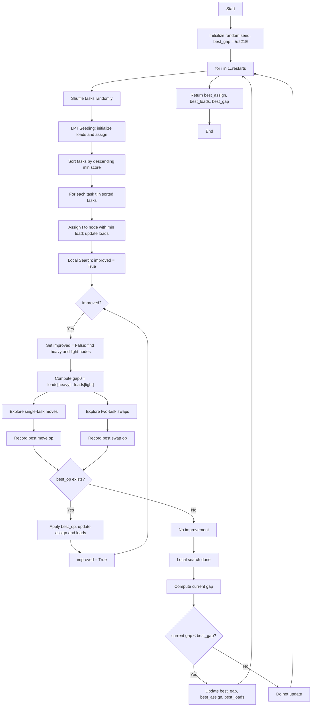

```mermaid
    flowchart TD
        A[Start] --> B[Initialize random seed, best_gap = \u221E]
        B --> C[for i in 1..restarts]
        C --> D[Shuffle tasks randomly]
        D --> E[LPT Seeding: initialize loads and assign]
        E --> F[Sort tasks by descending min score]
        F --> G[For each task t in sorted tasks]
        G --> H[Assign t to node with min load; update loads]
        H --> I[Local Search: improved = True]
        I --> J{improved?}
        J -->|Yes| K[Set improved = False; find heavy and light nodes]
        K --> L["Compute gap0 = loads[heavy] - loads[light]"]
        L --> M[Explore single-task moves]
        M --> N[Record best move op]
        L --> O[Explore two-task swaps]
        O --> P[Record best swap op]
        N & P --> Q{best_op exists?}
        Q -->|Yes| R[Apply best_op; update assign and loads]
        Q -->|No| T[No improvement]
        R --> S[improved = True]
        S --> J
        T --> U[Local search done]
        U --> V[Compute current gap]
        V --> W{current gap < best_gap?}
        W -->|Yes| X[Update best_gap, best_assign, best_loads]
        W -->|No| Y[Do not update]
        X & Y --> C
        C --> Z[Return best_assign, best_loads, best_gap]
        Z --> AA[End]
```