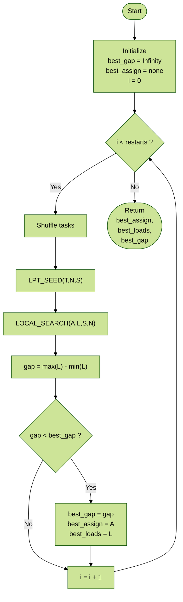

```mermaid
%%{init: {'theme': 'forest'}}%%
flowchart TD
    Start([Start])
    Init["Initialize <br/>best_gap = Infinity<br/>best_assign = none<br/>i = 0"]
    CheckRestarts{ i < restarts ? }
    Shuffle[Shuffle tasks]
    LPTSeed["LPT_SEED(T,N,S)"]
    LocalSearch["LOCAL_SEARCH(A,L,S,N)"]
    ComputeGap["gap = max(L) - min(L)"]
    Better{ gap < best_gap ? }
    UpdateBest["best_gap = gap<br/>best_assign = A<br/>best_loads = L"]
    Increment[i = i + 1]
    End(["Return<br/>best_assign,<br/>best_loads,<br/>best_gap"])

    Start --> Init
    Init --> CheckRestarts
    CheckRestarts -- Yes --> Shuffle
    Shuffle --> LPTSeed
    LPTSeed --> LocalSearch
    LocalSearch --> ComputeGap
    ComputeGap --> Better
    Better -- Yes --> UpdateBest
    Better -- No --> Increment
    UpdateBest --> Increment
    Increment --> CheckRestarts
    CheckRestarts -- No --> End
```
