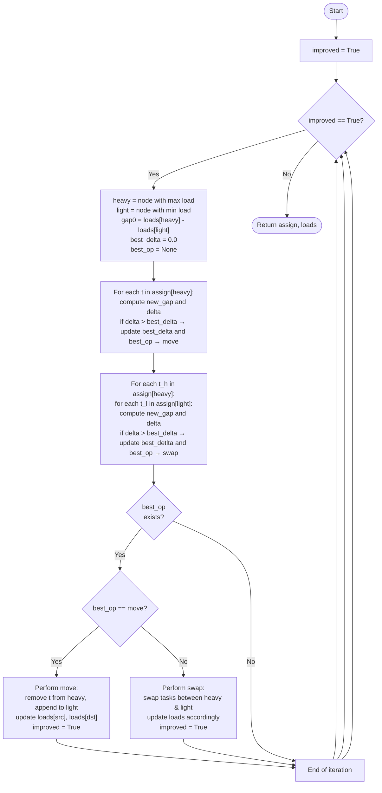

```mermaid
flowchart TD
    Start([Start])
    Init["improved = True"]
    While{"improved == True?"}
    ComputeExtremes["heavy = node with max load<br/>light = node with min load<br/>gap0 = loads[heavy] - loads[light]<br/>best_delta = 0.0<br/>best_op = None"]
    MoveLoop["For each t in assign[heavy]:<br/>compute new_gap and delta<br/>if delta > best_delta → update best_delta and best_op → move"]
    SwapLoop["For each t_h in assign[heavy]:<br/>for each t_l in assign[light]:<br/>compute new_gap and delta<br/>if delta > best_delta → update best_detlta and best_op → swap"]
    CheckOp{"best_op<br/>exists?"}
    OpMove{"best_op == move?"}
    DoMove["Perform move:<br/>remove t from heavy, append to light<br/>update loads[src], loads[dst]<br/>improved = True"]
    DoSwap["Perform swap:<br/>swap tasks between heavy & light<br/>update loads accordingly<br/>improved = True"]
    LoopBack["End of iteration"]
    End([Return assign, loads])

    Start --> Init --> While
    While -- Yes --> ComputeExtremes --> MoveLoop --> SwapLoop --> CheckOp
    CheckOp -- Yes --> OpMove
    OpMove -- Yes --> DoMove --> LoopBack --> While
    OpMove -- No  --> DoSwap --> LoopBack --> While
    CheckOp -- No  --> LoopBack --> While
    While -- No  --> End
```