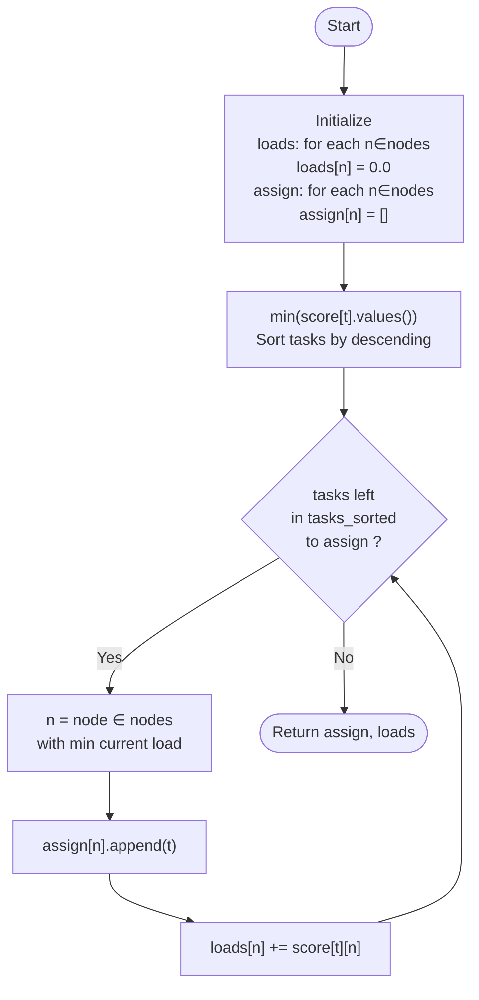

```mermaid
flowchart TD
    Start([Start])
    Init["Initialize<br/>loads: for each n∈nodes<br/>loads[n] = 0.0<br/>assign: for each n∈nodes<br/>assign[n] = []"]
    Sort["min(score[t].values())<br/>Sort tasks by descending"]
    CheckMore{tasks left <br/>in tasks_sorted <br/>to assign ?}
    SelectNode["n = node ∈ nodes<br/>with min current load"]
    AssignTask["assign[n].append(t)"]
    UpdateLoad["loads[n] += score[t][n]"]
    End([Return assign, loads])

    Start --> Init
    Init --> Sort
    Sort --> CheckMore
    CheckMore -- Yes --> SelectNode
    SelectNode --> AssignTask
    AssignTask --> UpdateLoad
    UpdateLoad --> CheckMore
    CheckMore -- No --> End

```